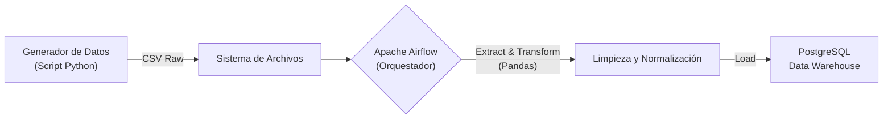

# 🧪 Automated Clinical Lab ETL Pipeline (Airflow + Docker)

## 📋 Descripción del Proyecto
Este proyecto consiste en un **Pipeline de Ingeniería de Datos End-to-End** que automatiza la ingesta, limpieza y carga de resultados de laboratorio clínico masivos.

Se construyó una arquitectura contenerizada utilizando **Docker**, donde **Apache Airflow** orquesta el flujo de datos (DAGs), procesando archivos crudos con **Pandas** y cargándolos en un Data Warehouse en **PostgreSQL**.

## 🏗️ Arquitectura de la Solución


### 🔑 Componentes Clave

- **Fuente de datos:**  
  Datos simulados de laboratorio clínico (5,000 registros) con ruido y errores intencionales.

- **Transformación de datos:**  
  - Normalización de valores negativos  
  - Imputación de valores nulos  
  - Tipado y validación de datos

- **Infraestructura:**  
  Despliegue mediante `docker-compose` con servicios aislados y reproducibles.

---

## 🛠️ Tecnologías Utilizadas

- **Docker & Docker Compose** – Infraestructura como Código (IaC)
- **Apache Airflow 2.9** – Orquestación y calendarización de tareas
- **Python 3.10** – Motor de procesamiento ETL  
  - Pandas  
  - SQLAlchemy
- **PostgreSQL 16** – Base de datos destino (Data Warehouse)
- **Linux (Pop!_OS)** – Entorno de desarrollo

---

## 🔧 Desafíos Técnicos y Soluciones (Troubleshooting)

### 1️⃣ Gestión de Dependencias en Contenedores (Custom Image)

**Problema:**  
La imagen base de Apache Airflow no incluye librerías de ciencia de datos (`pandas`, `sqlalchemy`), lo que ocasionaba errores de ejecución como:

**Código implementado (`Dockerfile`):**

```dockerfile
FROM apache/airflow:2.9.1

# Instalación de dependencias al construir la imagen
RUN pip install --no-cache-dir pandas sqlalchemy psycopg2-binary
```

### 2️⃣ Conflictos de Permisos en Volúmenes (Linux)
**Problema:**  
Al mapear volúmenes locales (./logs, ./data) al contenedor, Airflow (UID 50000) no tenía permisos de escritura sobre las carpetas del host (usuario local), generando errores PermissionError: [Errno 13].

**Solución:**  
Se aplicó una apertura de permisos recursiva en el entorno de desarrollo para permitir que el contenedor escribiera logs y archivos intermedios.

**Comando de solución:**
```bash
sudo chmod -R 777 dags data logs
```

## 🚀 Cómo Ejecutar el Proyecto

### 1️⃣ Clonar el Repositorio
```bash
git clone https://github.com/DanCruzA/Clinical-ETL-Airflow.git
cd Clinical-ETL-Airflow
```

### 2️⃣ Generar la Data Simulada:
```bash
python3 generar_data.py
```

### 3️⃣Desplegar la Infraestructura:
El flag --build es importante para crear la imagen con Pandas
```bash
docker-compose up --build -d
```

### 4️⃣ Acceder a Airflow:

- URL: http://localhost:8085

- Credenciales: admin / admin

- Activar el DAG etl_laboratorio_clinico.

## 📊 Verificación de Datos
Ahora vamos a confirmar que los datos realmente viajaron del CSV a la Base de Datos y que se limpiaron.

Ejecuta este comando en tu terminal para entrar a tu Data Warehouse y consultar la tabla:
```bash
docker exec -it p3_postgres_dw psql -U data_engineer -d dw_clinica
```

Una vez dentro (dw_clinica=#), se puede verificar la carga en el Data Warehouse:

**¿Llegaron los 5000 registros?**

```sql
-- Verificar corrección de valores negativos y conteo total
SELECT count(*) FROM fact_resultados_lab;
-- Resultado esperado: 5000
```

**¿Se arreglaron los valores negativos?**  
Recuerda que en el CSV había valores como -150. Aquí todos deberían ser positivos.

```sql
SELECT count(*) FROM fact_resultados_lab WHERE resultado_valor < 0;
-- (Debería decir: 0. ¡Si sale 0, tu limpieza funcionó!)
```

**¿Se llenaron los técnicos vacíos?**  
Recuerda que había nulos. El script debía ponerles "Sin Asignar".

```sql
SELECT count(*) FROM fact_resultados_lab WHERE tecnico_responsable = 'Sin Asignar';
-- (Debería salir un número mayor a 0, alrededor de 200-300)
```
